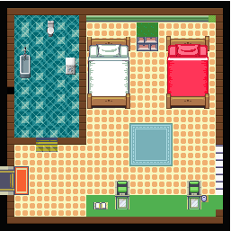

# Current Scenes

# Sample gameplay Video

# HOW TO RUN THE GAME: 

either drag the game.gb file (in ./rom/game.gb) into bgb.exe or run index.html. If index.html doesn't run the game, use the emulator.

## Browser Controls:

Up - Up Arrow  
Down - Down Arrow  
Left - Left Arrow  
Right - Right Arrow  
A/Interact key - Z  
B/Back key - X  
Start - Enter  
Select - Shift  

Edit by changing `bindKeyboard` in `js/other/controls.js`.

## Emulator Controls:

Up - Up Arrow  
Down - Down Arrow  
Left - Left Arrow  
Right - Right Arrow  
A/Interact key - S  
B/Back key - A button  

[Game backgrounds are given in the assets folder]

[The json file is the main configuration file for the game (open with Notepad).]
